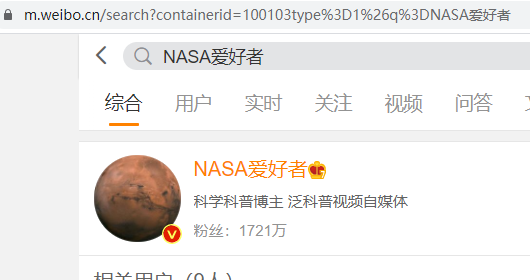
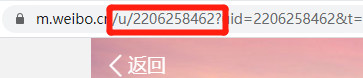

# 使用说明
## 获取要爬的微博的ID
1. 
2. 
3. 注意打开的是m.weibo.cn
## 初始化
1. 删除contents.json 如果有
2. 删除***.csv 如果有
3. 修改config.json 里面的 uids,改为你自己要怕的uid获取方法在上面
4. status.config 里面两个长数字都改成0
5. 以上情况是针对初始化的(初始化就是刚开始爬微博,而不是已经爬了一半)
## 说明
本人只是存了用户ID和昵称,要具体信息查询JSON以后重新写一个入库就可以了,
这是通过APP抓包获取的理论上对方的借口信息,和开放者平台借口基本差不多。
GSID可以通过抓包打开微博APP随便抓一个包,找到参数GSID就可以,目测签名
有效期非常的长。QPS我限制在1/1.1这样是不会418限制的,安全
## 关于
对于MAC....来个人写一个SH脚本就行了